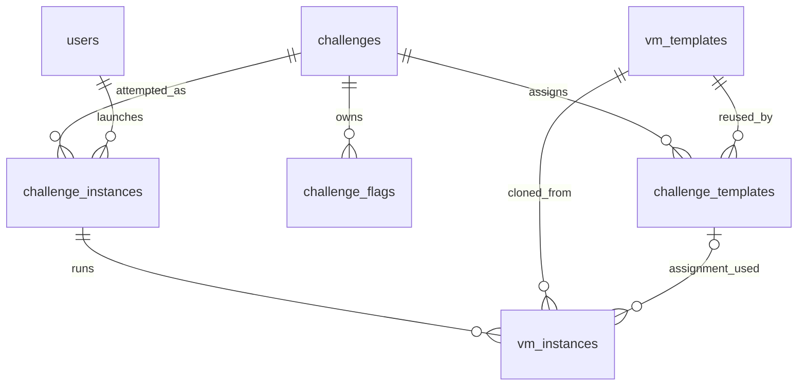

# Redduck challenge update — installation and review

This update is based on `ThePondNewVers.zip`. It supports `vm`, `container_lab`
(Redduck plus the separate Docker server), and physical `offline` challenges.
Read this guide before older upload documentation where their schema descriptions
differ. The upload, approval and notification workflow remains in place.

The package contains changed/new files, a patch and documentation; it is **not the
whole system**. It does not include a Docker server, its transport adapter, VM
images, credentials, a database, or unrelated integration repairs. Test doubles
live only in tests. Existing account creation, approval and seeding are retained.

## What changes

| Area | Result |
|---|---|
| `challenges` | Adds `execution_type` and a stable `docker_challenge_key`. Titles can change independently. |
| New `challenge_templates` | Assigns a reusable template to a challenge; owns role, boot order, static IP, hostname prefix, network and accessibility. |
| `vm_templates` | Keeps reusable Proxmox template identity/resources, rather than belonging to one challenge. |
| `challenge_flags` | Belongs to the challenge; template reference is optional. Shared Redduck does not share challenge answers or scores. |
| `challenge_instances` | Stores Docker lookup key snapshot, operation key, session reference, status and a safe error message. |
| `vm_instances` | Records the challenge-template assignment used for the clone. Many clones can use the same template. |
| Publication | Supports metadata-only container/offline manifests, with existing approval. Ordinary VM import behavior remains. |
| Student pages | Show the correct launch/console or physical instructions and record completion. |

There are no new asset, service, revision, verification or dynamic-flag tables.
Flags remain static hashes. No new launch readiness, file-content or VM-image
verification is introduced. Existing upload checks remain. Checking that an
adapter is configured and a template mapping exists is normal launch setup.



`CONTAINER_LAB_SCHEMA.sql` is reference DDL for the affected tables, not an
installation script. The remaining tables, including accounts and ingestion
history, remain part of the same database.

## 1. Apply the code on your existing test branch

Run from your repository. Preserve/commit your own work first; `git status` should
be clean. Do not commit database files or private settings.

```bash
cd ~/26_ITP2_Group6_ThePond
git status --short
git branch --show-current
source .venv/bin/activate
unzip ~/Downloads/the-pond-container-lab-update.zip -d /tmp/pond-container-review
git apply --check /tmp/pond-container-review/the-pond-container-lab-update/update.patch
git apply /tmp/pond-container-review/the-pond-container-lab-update/update.patch
git diff --stat
python -m pytest tests -q
```

Adjust the downloaded ZIP path. Use a new extraction directory if the above one
already exists. If `git apply --check` fails, stop and merge the affected files
with your teammate's version. `implementation/` contains complete changed files
for comparison; copying them over newer files can discard your teammate's work.
`BASELINE_SHA256.json` identifies the exact originals used to create the patch.
Git will show new files as untracked until added.

## 2. Update the schema on a test database first

**Migration here means changing the schema in your existing SQLite database.**
It does not switch database engines, recreate accounts or import the old temporary
authentication database. SQLAlchemy remains the application's database layer.

The app uses the `pond` SQLAlchemy bind. In the supplied ZIP its default is
`the_pond.db` at the repository root; `POND_SETTINGS` can override that. Confirm
the actual database path used by web and workers before running these commands.
The migration CLI always uses the explicit path you pass, independent of app config.

Stop the web application and ingestion workers before applying to their database,
and finish or reconcile active attempts first. Stop/start commands depend on your
deployment service names; this package does not invent replacements for them.

Example using the default database location:

```bash
POND_DB="$PWD/the_pond.db"
python -m db.migrate_container_labs --database "$POND_DB" --check
mkdir -p "$HOME/pond-backups"
chmod 700 "$HOME/pond-backups"
POND_BACKUP="$HOME/pond-backups/before-container-labs-$(date +%Y%m%d-%H%M%S).sqlite"
python -m db.migrate_container_labs --database "$POND_DB" --apply \
  --backup "$POND_BACKUP" --confirm-existing-vm
python -m db.migrate_container_labs --database "$POND_DB" --check
python -m db.init_database --check
```

Only use `--confirm-existing-vm` after confirming that all existing challenge rows
should initially be classified `vm`. The supplied schema cannot reliably infer
physical challenges. If your database already includes those, review their
classification before applying this migration.

The migration creates a new, private backup and refuses to overwrite one. It
preserves challenge/template/flag/attempt IDs, accounts, password hashes and score
records; creates assignments from existing template relationships; and rolls back
failed changes. It refuses detected partial migrations, unrecognized columns,
custom views or broken foreign keys rather than repairing unrelated integration
issues. It targets the supplied schema, not arbitrary customized schemas. Review
custom constraints and schema changes from teammates separately.

For a genuinely new, empty database only, use `python -m db.init_database` instead
of the migration. Initialization creates missing tables and roles; it cannot
alter existing tables. Do not delete your database to install this update. No
account reseeding is necessary.

If rollback is needed, keep services stopped, retain the failed database for
inspection, and restore the verified backup together with the pre-update code.
Do not run old code against the new schema or new code against the old schema.
Database writes after migration would be lost when restoring that backup.

## 3. Register the existing Redduck template

Use the same private settings/environment as the web service. If your deployment
uses a settings file, load its actual path, for example:

```bash
export POND_SETTINGS=/etc/the-pond/settings.py
```

This is a deployment-specific path, not a file included in this update. Keep
existing database, quarantine and Proxmox configuration. Web and workers must
share the same database and private quarantine settings.

Once the actual Redduck template exists in Proxmox, record its metadata:

```bash
python -m db.register_template --name redduck --vmid 1200 --node pve
```

Replace `1200` and `pve` with the actual template VMID and node. This command does
not build, clone or inspect the VM. It prints the database `Template ID`, which
is what the manifest's `workstation_template_id` needs. Repeating the same
registration returns the existing ID; conflicting metadata is rejected.

## 4. Publish a challenge definition

Start from `examples/challenge_uploads/container_lab.json`:

- Set the title, instructions and category.
- Set `docker_challenge_key` to the stable identifier your Docker server will use.
- Set `workstation_template_id` to the database ID from step 3.
- Keep `vms` and `network_rules` empty for this execution type.
- Replace the demonstration flag hash, or use an empty `flags` list for unscored exercises.

Use `examples/challenge_uploads/offline.json` for physical challenges. It needs
neither a workstation ID nor a Docker key. Existing `vm` and `scored_vm` version-1
upload manifests are still supported; both become execution type `vm`.

Use the existing administrator upload page to submit the manifest, then run the
existing validation worker. For a manual bounded worker invocation:

```bash
python -m challenge_ingestion.runtime --mode validate --worker-id manual-validation
```

Have a sysadmin review/approve and request publication in the existing UI, then:

```bash
python -m challenge_ingestion.runtime --mode publish --worker-id manual-publication
python -m challenge_ingestion.runtime --mode notify --worker-id manual-notifications
```

Each invocation processes at most one job (notifications use a bounded batch).
Existing scheduled workers can perform these actions instead. Keep existing
private quarantine configuration even for metadata-only manifests. A legacy
`publication_disabled: true` result means VM imports lack their adapter; it does
not disable container/offline metadata publication.

Publication stores the definition without contacting Docker. Do not advertise a
Redduck challenge as usable until the actual adapter/server is available.

## 5. Connect your teammate's Docker server

Give your teammate `DOCKER_ADAPTER_CONTRACT.md`. Their trusted Python integration
object is installed as `CONTAINER_LAB_ADAPTER` in the private app configuration.
No transport, hostname, port, netcat protocol or credential is guessed here.

Launch creates a fresh Redduck clone and calls the adapter with the stable
challenge key and workstation identifiers. The Docker server supplies exercise
files and hosted services. Pond retains its operation/session identity for cleanup.
Closing/completing the attempt requests Docker cleanup and follows the existing
VM destruction path. Offline attempts use no VM or Docker request.

Until that adapter is configured, Redduck launch reports a configuration error
before cloning anything. Existing VM/offline paths are independent of it.

## 6. Test, review and commit

```bash
python -m pytest tests -q
git diff --check
git status --short
```

Review the changed/new files, then add only those intended for this feature and
commit on your test branch. The package's `FILES.txt` lists the deliverable files.
Do not stage local databases, credentials, VM files or backup files. Coordinate
merging shared files with the teammate repairing integration issues.

With the real server available, test a normal VM, two distinct Docker challenges
sharing Redduck, a physical offline attempt, flag scoring, finish/abandon cleanup
and a failed Docker cleanup followed by recovery. Also exercise frontend account
registration/approval against the configured test database. Automated tests use
temporary databases and simulated external services; they cannot certify your
cluster, network or Docker implementation.

## Recovery of Docker cleanup

Failed cleanup leaves `docker_status=cleanup_pending` and retains the operation
key/session reference. For a **closed** attempt, retry using the same deployment
settings:

```bash
python -m db.cleanup_docker_session --instance-id 123
```

Replace `123` with the actual challenge instance ID. The command refuses active
attempts. A crashed launcher can leave `provisioning`/`requested` state; establish
that the launcher has stopped and reconcile the VM and Docker resources before
changing that attempt's state. There is no new automatic crash-recovery daemon.
The CLI retries Docker cleanup only; existing Proxmox cleanup failures still need
the existing operator workflow. Docker status records operation acknowledgements,
not independently verified readiness or resource absence.
