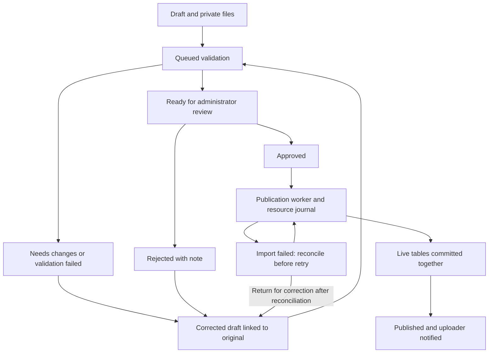

# Challenge upload implementation — review entry point

The upload button calls routes in `pond-sec/app/uploads.py`. Those routes use
`challenge_ingestion/intake.py` to store a draft and quarantine uploaded bytes.
Workers validate submitted revisions; sysadmins review and queue publication.
Database tables do not scan files themselves.

## Database map

All records use the existing `pond` database. There is no second empty database.

| Table | Purpose | Main links |
|---|---|---|
| challenge_submissions | Manifest, uploader, frozen digest, status and approval | users; previous submission; published challenge |
| submission_files | File inventory, private storage key, size/hash and validation status | submission |
| submission_jobs | Durable queue, lease, retries, external resource recovery journal | submission; requesting user |
| submission_issues | Specific validation findings and history | submission; job; optional file |
| notification_outbox | Durable in-app notifications and read status | submission; recipient |
| audit_logs (existing) | Validation, review and publication evidence | actor; target |
| challenges (existing) | Published challenge metadata | creator |
| vm_templates (existing) | Approved/imported template identities and VM resources | challenge |
| challenge_flags (existing) | Hashed flags and scoring | template |
| network_rules (existing) | Requested inter-VM rules | challenge |

`UPLOAD_SCHEMA.sql` is generated reference DDL for the five new tables and indexes,
not a migration to blindly apply to a populated database. Models are canonical.
Use the initialization/check procedure in `DATABASE_INITIALIZATION_SETUP.md`.
The latest publication work adds no further tables or migration.

## Lifecycle

Submissions and issues are durable staging/history records, not disposable cache
rows. A failed upload is retained; correction makes a new revision. Only a fully
validated, approved and prepared revision reaches live challenge tables. This
prevents missing-file corrections from accidentally exposing a partial challenge.
Notifications currently appear in the in-app inbox; no email/Slack is sent.

## Review the code

1. `db/submission*_models.py`, `db/notification_models.py`: constraints and relations.
2. `challenge_ingestion/requirements.py`, `validation.py`, `storage.py`: required
   files, bounded manifests, quarantine and mandatory source checks.
3. `intake.py`, `worker.py`, `notifications.py`: immutable revisions, validation
   jobs and delivery.
4. `review.py`, `publication.py`: approval binding, journal/recovery and live-table
   transaction. `PUBLICATION_SETUP.md` explains the deployment adapter contract.
5. `pond-sec/app/uploads.py` and admin submission templates: authenticated upload,
   findings, correction, administrator review and publication controls.
6. `runtime.py`, `deployment/pond-settings.example.py`: shared configuration and
   bounded worker commands.

## Deployment status and review limits

The database/web workflow and publication orchestration are implemented and
covered by automated tests. Production VM integration is still incomplete:
the approved-template verifier, isolated image inspector and Proxmox
prepare/readiness adapter must be implemented for your environment. They default
to unavailable, so uploads cannot silently bypass them. No infrastructure was
contacted or modified during development, and no live end-to-end VM test was run.

Before enabling VM publication, confirm node/storage mappings, template catalog,
reserved VMID range, import transport, isolated network, task reconciliation and
inspection policy. These are deployment inputs absent from the supplied upload
workflow; the code does not invent them. Also review retention policy, backups,
proxy upload/time limits and worker supervision. This version retains artifacts
and has no automatic purge or hypervisor cleanup daemon.

The existing student VM runtime is outside this change. Saving network rules does
not itself enforce them: the deployment adapter and runtime must enforce the same
network policy. Test launch, isolation, flags and teardown on your staging cluster
before exposing uploaded challenges to students.

See `TEST_RESULTS.md` for the exact verification scope. The consolidated ZIP is
an overlay of all upload-workflow changes and dependencies from steps 1 onward;
back up and merge it into the current repo rather than replacing unrelated work.
