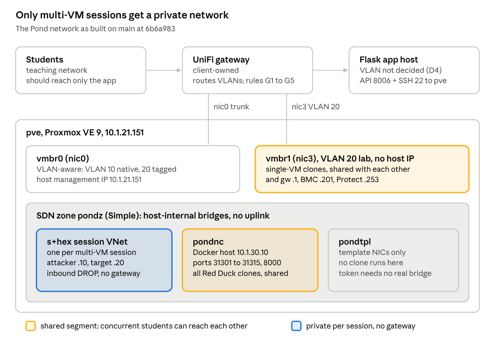

# The Pond — Network Technical Specification & Build Guide

Oct 7, 2026 · Lochlan Hardie, Technical Lead, ITP2 Group 6

## 1. Purpose, scope and sources

This is the single networking reference for The Pond: what the network is, why it is built that way, and how to rebuild it on a bare Proxmox host. It satisfies the "setup, configuration, deployment" part of Charter deliverable #12 for the network layer and the Scrum Plan V0/V5 topology requirement.

**Source of truth.** Everything marked *as built* was read from `main` at commit `6b6a983` (6 Oct 2026): `provisioner.py`, `pond-sec/app/themes.py`, `pond-sec/app/config.py`, `playbooks/pond_least_privilege.yml`, `vars/challenges/*.yml` and `tools/gen_bsides_challenges.py`. Anything about the live host that the code cannot prove is marked **VERIFY**, with the command that proves it. Where the code and an older document disagree, the code wins and the disagreement is listed in Section 10.

**What it replaces.** Section 4 of `docs/networking/pond-infrastructure-documentation.docx` (written at V2, before session VNets existed), the networking rows of the Scrum Plan, and the lost `/tmp/arena-networking/synthesized-guide.md`.

**Out of scope.** The upstream UniFi gateway and switch configuration belong to the client (Charter §4.7: the client's physical network is out of scope). This document records what the Pond *requires* of them, not how they are configured.

## 2. Required networking documentation

Five artefacts are required, not twelve. The earlier list (`claude/networking-docs.md`) split the network into 12 separate documents; with roughly four weeks to Project Review 2 (Week 13, from 19 Oct), most of them belong as sections of this one specification. Only the items that have a different author, a different reader, or need live evidence stay separate.

| # | Artefact | Why it is required | Where it lives | Status |
| --- | --- | --- | --- | --- |
| 1 | Network technical specification | Charter #12 (configuration); Charter §4.6 phase 2 ("infrastructure integration"); NFR §4.4 isolation | This doc, Sections 3–7 | Drafted; VERIFY items open |
| 2 | Network build guide, bare host to running | Charter #12 (setup, deployment: "sufficient to reproduce"); Scrum V5 "deployment reference" | This doc, Section 8 | Drafted; not yet run end-to-end |
| 3 | Network topology diagram | Scrum V0 ("Proxmox host + VLAN topology", "architecture diagram reviewed") | This doc, Section 3 | Drafted from code + memory; confirm against live host |
| 4 | Isolation verification record | Charter #11 (recorded test evidence); Risk R09 ("isolation tested before any supervised session") | This doc, Section 9 (procedure); results table filled on the live host | Procedure written; **no results exist yet** |
| 5 | Upstream gateway requirements | NFR §4.4 (isolated from host and admin functions); SECURITY\_ASSESSMENT H2 | Section 7.5 states the rules; client confirms they exist | Needs client or gateway admin |

Sections 4–7 absorb the remaining items from the old list: IP and VMID allocation (§4), firewall and `network_rules` reference (§6), console path, app exposure, Proxmox access path and container-lab path (§7). A troubleshooting runbook is folded into Section 8 as per-phase failure notes, because each known failure (missing gateway, VLAN tag mismatch, SDN apply) belongs to a specific build step.

**Corrections to the old list.** Two of its findings are wrong on `main`. The console no longer sends students to `10.1.21.151:8006`; `themes.console()` relays it server-side (§7.1). And it missed a third network: the Docker challenge host at `10.1.30.10` on a VNet called `pondnc` (§4, §7.4).

## 3. Architecture overview

The Pond has three trust zones: the management plane (VLAN 10), the shared lab LAN (VLAN 20), and host-internal SDN VNets that never leave the Proxmox box. Students should only ever touch the Flask app; challenge VMs should only ever touch their own segment.



Amber marks the two places students currently share a segment (§5.2): single-VM clones on `vmbr1`, and every Red Duck clone on `pondnc`. Bridge-to-NIC mapping and `pondtpl` are **VERIFY** items (§10.4).

## 4. Addressing, VLAN, bridge, SDN and VMID plan

The Pond uses three address spaces, and they do different jobs: VLAN 10 is the management plane, VLAN 20 is the shared lab LAN, and SDN VNets are private per-session or per-service segments that exist only inside the Proxmox host.

### 4.1 Host and physical layer

| Item | Value | Source |
| --- | --- | --- |
| Node | `pve`, Proxmox VE 9 on Debian 13 (Trixie), single node | project memory |
| Hardware | 2× Xeon E5-2698 v4 (80 threads), 755 GiB RAM, `local-lvm` thin pool \~612 GiB | project memory |
| Management IP | `10.1.21.151/24`, gateway `10.1.21.1` | `config.py` `PROXMOX_HOST`; infra docx §4.1 |
| NIC → bridge | `nic0` → `vmbr0` (VLAN-aware; native VLAN 10, also carries tagged frames); `nic3` → `vmbr1` (VLAN 20, no host IP) | project memory — **VERIFY** `cat /etc/network/interfaces` |
| Inter-VLAN routing | Upstream UniFi gateway, not Proxmox | project memory; SECURITY\_ASSESSMENT H2 |

### 4.2 Networks

| Network | Subnet | Gateway | Carried by | Who lives there | Source |
| --- | --- | --- | --- | --- | --- |
| VLAN 10, management | `10.1.21.0/24` | `10.1.21.1` | `vmbr0` untagged | Proxmox host, admin/control nodes | `config.py`, infra docx |
| VLAN 20, lab | `10.1.20.0/24` | `10.1.20.1` (tested on VMID 308, 16 Sep) | `vmbr1`, or `vmbr0` tag 20 — **VERIFY which** | Single-VM challenge clones; also the server BMC `10.1.20.201` and UniFi Protect `10.1.20.253` | `config.py` `PROXMOX_LAB_GATEWAY`; SECURITY\_ASSESSMENT H2 |
| SDN zone `pondz` | Simple zone, no subnets | none | Host-internal bridges | Container for per-session VNets | `provisioner.py` `VNET_ZONE`; `config.py` |
| Session VNets `s<hex instance_id>` | none defined; guests use `10.10.10.0/24` statics from challenge YAML | none, by design | One bridge per multi-VM session | Attacker + target clones of one session | `provisioner._session_vnet_name()`; `vars/challenges/dc1.yml` |
| VNet `pondnc` | guests use `10.1.30.0/24` (Docker host `.10`) | **VERIFY**: whether a subnet/gateway/SNAT is defined | Host-internal bridge | Docker challenge host; Red Duck clones for container challenges | `tools/gen_bsides_challenges.py` line 16 |
| VNet `pondtpl` (recommended) | none | none | Host-internal bridge | Template NICs only, so the token needs no grant on a real bridge | `pond_least_privilege.yml` header — **VERIFY** whether created |

Why `10.10.10.x` can repeat across sessions: each session VNet is its own broadcast domain, so two sessions both using `10.10.10.10` never see each other (`create_session_vnet()` docstring). The same address on the shared VLAN 20 *would* collide.

### 4.3 Session VNet naming

VNet IDs are `s` + the `ChallengeInstance` id in hex (instance 255 → `sff`). Proxmox limits VNet IDs to 8 characters because the ID becomes a Linux bridge interface name ([Proxmox SDN docs, VNets](https://pve.proxmox.com/pve-docs/chapter-pvesdn.html)); `VNET_ID_RE` enforces this, so the scheme runs out at instance `0xfffffff` (268 million).

### 4.4 VMID plan (as configured on `main`)

| Range | Use | Defined in |
| --- | --- | --- |
| 300–303 | Another project's VMs — never touched (`PROXMOX_PROTECTED_VMIDS`) | `config.py`; `_refuse_protected()` |
| 1101–1199 | `lockedshields` session clones | `vars/challenges/lockedshields.yml` |
| 1201–1299 | `metasploitable2` session clones | `vars/challenges/metasploitable2.yml` |
| 1301–1399 | `dc1` **and** `kioptrixlevel1` session clones (shared range) | both YAML files |
| 9000+ | `PROXMOX_CLONE_POOL_START` default | `config.py` |
| 10000+ | Templates: `10000` Metasploitable 2, `10001` `Kali-attacker` (Red Duck), `10002` DC-1 | project memory |

The Scrum Plan's "301+" scheme is obsolete and collides with the protected range. Section 10 lists the remaining overlaps.

## 5. Isolation model by challenge type (as built)

Only multi-VM challenges are isolated on `main`. The deciding line is `themes.py` line 379, `if len(assignments) > 1:` — a session VNet is created only when a challenge maps more than one VM template. Every single-VM launch keeps the template's own bridge, so 17 of the 19 challenge files currently land on a shared segment. Until that changes, no document should claim participants are isolated from each other (Charter NFR §4.4).

| Challenge type | Challenges on `main` | Network a clone lands on | Firewall | Static IP / gateway | Isolated from other students? |
| --- | --- | --- | --- | --- | --- |
| Multi-VM | `dc1`, `kioptrixlevel1` | New session VNet `s<hex>` in `pondz` | VM firewall on, `policy_in=DROP`, allow rules from `network_rules` | Injected from YAML; gateway forced off (VNet has no router) | **Yes**, at L2 |
| Single-VM target | `metasploitable2`, `lockedshields` | Template's own `net0` bridge (VLAN 20 if templates are set up as §8 says) | None | None set in YAML, so the template's baked config is kept; gateway injected only when a static IP is set | **No** — every concurrent clone shares the segment |
| Container lab (Red Duck + Docker) | 15 BSides challenges (`curveball`, `dockjmp`, …) | Template `10001` `Kali-attacker`'s bridge — presumably `pondnc`, since it must reach `10.1.30.10` — **VERIFY** | None | None; firstboot `wget` of handouts from `10.1.30.10:8000` | **No** — all Red Duck clones share one segment with each other and the Docker host |
| Offline | lock-picking etc. | No VM | n/a | n/a | n/a |

### 5.1 Why multi-VM isolation works

1. `create_session_vnet()` posts a VNet to the Simple zone and applies SDN (`client.cluster.sdn.put()`). A Simple zone VNet is a host-internal bridge "not linked to a physical interface" ([Proxmox SDN docs, Simple Zones](https://pve.proxmox.com/pve-docs/chapter-pvesdn.html)), so frames on it cannot leave the host.
2. No subnet is defined, so Proxmox puts no gateway address on that bridge. The host itself is therefore not an L3 neighbour of the guests.
3. `clone_and_start()` rewrites `net0` to `bridge=<vnet>`, strips any `tag=`, and adds `firewall=1` before the first boot, so the guest never touches VLAN 20.
4. After all clones are up, `enable_vm_firewall()` sets `policy_in=DROP` and `apply_network_rule()` adds one ACCEPT per YAML rule on the destination VM.

### 5.2 Consequences of the single-VM gap

- **Student-to-student reach.** Two students running Metasploitable 2 at once are on the same L2 segment. Either can attack the other's target, and if the template has a baked static IP, both clones claim the same address.
- **Red Duck to Red Duck.** Every container-lab student gets a Kali clone from the same template, with the same credentials, on the same segment. One student can log into another's attacker box.
- **Reach to lab infrastructure.** A VLAN 20 clone can reach `10.1.20.1`, the BMC `10.1.20.201` and UniFi Protect `10.1.20.253`, and possibly VLAN 10 if upstream inter-VLAN routing is open (SECURITY\_ASSESSMENT H2).
- **No attacker for single targets.** A single-VM target challenge has no attacker VM. On `main` the only way in is that target's own console, unless lab desktops on the teaching network can route to VLAN 20. This is an open design decision (Section 10).

### 5.3 Two fixes, in order of effort

1. **Change one condition.** Make the session VNet unconditional (`if assignments:`). Single-VM clones then get their own VNet. This breaks container-lab challenges, because Red Duck could no longer reach `10.1.30.10` — so it needs fix 2 for those.
2. **Per-session VNet plus a route to the Docker host.** Give each container-lab session its own VNet and put the Docker host on a second NIC per session, or route through a filtering VM. Both are design work, not a one-line change, and belong in V5 hardening.

## 6. Firewall and network\_rules specification

The per-VM rules the app writes do nothing unless the **datacenter** firewall is switched on, and `main` never checks that it is. Proxmox ships with the firewall "completely disabled by default" at cluster level, and each NIC needs its own `firewall=1` "in addition to the general firewall enable option" ([Proxmox firewall docs, Zones / VM configuration](https://pve.proxmox.com/pve-docs/chapter-pve-firewall.html)). Proxmox raises no error for the mismatch, so a launch looks fine while every rule is ignored. The unmerged fix described in SECURITY\_ASSESSMENT H1 refused to launch in that state; `main` does not.

### 6.1 Three layers, and which one the app controls

| Layer | Config file | Set by | Required state |
| --- | --- | --- | --- |
| Datacenter | `/etc/pve/firewall/cluster.fw` | Admin, once (§8 Phase 4) | `enable: 1` |
| Host (`pve`) | `/etc/pve/nodes/pve/host.fw` | Admin | Default; must still admit 8006 and 22 from the app host (§7.3) |
| VM | `/etc/pve/firewall/<VMID>.fw` | `enable_vm_firewall()` + `apply_network_rule()` | `enable=1`, `policy_in=DROP`, one ACCEPT per rule |
| NIC | `net0` in the VM config | `clone_and_start()` net0 rewrite | `firewall=1` |

File paths are from the [Proxmox firewall docs](https://pve.proxmox.com/pve-docs/chapter-pve-firewall.html).

### 6.2 How a YAML rule becomes a Proxmox rule

Each `network_rules` entry becomes one inbound ACCEPT on the **destination** VM, with the source VM's static IP as the source. The resource being protected owns the rule (`apply_network_rule()` docstring). For `dc1.yml`:

| YAML (`from` → `to`, port/proto) | Rule written on the target clone |
| --- | --- |
| attacker → target, 80/tcp | `IN ACCEPT -source 10.10.10.10 -dport 80 -p tcp` |
| attacker → target, 22/tcp | `IN ACCEPT -source 10.10.10.10 -dport 22 -p tcp` |

The attacker clone gets `policy_in=DROP` and no rules, so **nothing can open a connection to the attacker**. The Proxmox firewall tracks connection state, so replies to attacker-initiated connections still return. What fails is anything the target must initiate: reverse shells, a target fetching a payload from an attacker-hosted HTTP server, and callbacks such as the default reverse payload for Drupalgeddon2 in Metasploit. Either add `target → attacker` rules for a listener port range, or document that these challenges need bind shells. This must be tested before the demo (§9, test N7).

### 6.3 Rules the code silently skips

- A rule naming a role the challenge does not have (`themes.py` line 430: skip, don't crash).
- A rule whose source role has no `static_ip` (line 433).
- Any NIC other than `net0`: only `net0` is moved to the VNet and firewalled. A template with a second NIC keeps it on the original bridge.

### 6.4 Outbound and spoofing

The code never sets `policy_out`, and does not enable `ipfilter`. Inside a session VNet this is acceptable: the VNet has no gateway and contains only that student's own VMs. On a shared segment (single-VM path) neither is set either, but there the VM firewall is not enabled at all, so these are moot until §5.3 is done.

## 7. Service paths

Students need to reach exactly one thing: the Flask app. Every other path in this section is app-to-infrastructure, and the gateway rules in §7.5 exist to keep it that way.

| Flow | From | To | Port | Auth | Code |
| --- | --- | --- | --- | --- | --- |
| Web UI + console WebSocket | Student browser (teaching network) | Flask app | app port (see §7.2) | Session cookie | `themes.console()`, `console_relay()` |
| Proxmox API | Flask app | `10.1.21.151` | 8006/tcp | API token `pond@pve!launcher` | `proxmoxer` in `provisioner.py` |
| Console upstream | Flask app | `10.1.21.151` | 8006/tcp (`vncwebsocket`) | Same token + one-time VNC ticket | `console_relay()` |
| Disk injection | Flask app | `10.1.21.151` | 22/tcp | `root` SSH key | `inject_instance_network()`, `inject_firstboot_command()` |
| Handout download | Red Duck clone | `10.1.30.10` | 8000/tcp | none | firstboot `wget` |
| Challenge services | Red Duck clone | `10.1.30.10` | 31301–31315/tcp | none | `vars/challenges/*.yml` |
| Docker control | Flask app | Docker host | not specified | not specified | `DOCKER_ADAPTER_CONTRACT.md` |

### 7.1 Console relay

The browser never talks to Proxmox. `console()` checks the session belongs to the user, issues one `vncproxy` ticket, and renders a page whose noVNC client opens a WebSocket back to Flask. `console_relay()` then opens `wss://10.1.21.151:8006/api2/json/nodes/<node>/qemu/<vmid>/vncwebsocket` with the API token header and pumps frames both ways. This closes the old "students are redirected to 8006" finding.

**Defect — the relay ignores the CA bundle.** `console_relay()` passes `sslopt={"cert_reqs": CERT_REQUIRED}` with no `ca_certs`, so it verifies Proxmox's self-signed certificate against the system store, not `PROXMOX_CA_BUNDLE`. With verification on and the CA bundle configured, API calls succeed but the console fails TLS. Fix: add `"ca_certs": cfg["PROXMOX_CA_BUNDLE"]` to `sslopt` ([websocket-client, SSL options](https://websocket-client.readthedocs.io/en/latest/faq.html#what-else-can-i-do-with-sslopts)). The `Clone.console_url` field (`https://…:8006/?console=kvm…`) is still built but unused; delete it so nobody wires it back in.

### 7.2 Web app exposure

`pond-sec/wsgi.py` binds `0.0.0.0:5001` when run directly; the documented gunicorn command binds `127.0.0.1:8000` behind a proxy (SECURITY\_ASSESSMENT, bind-address row). Which one is deployed, on which host and VLAN, is undecided. Requirements regardless of placement:

- Reachable from authorised teaching-network devices (Charter Must: "access … from authorised devices on the teaching network").
- **Not** reachable from VLAN 20 or any VNet, so a compromised challenge VM cannot attack the orchestrator.
- Able to reach `10.1.21.151` on 8006 and 22.
- `TRUSTED_PROXIES` set to the number of reverse proxies in front, and `0` when there are none, or rate limits can be bypassed with a forged `X-Forwarded-For` (`.env.example`).

### 7.3 Proxmox access path

- **API token.** `pond@pve!launcher`, created only by `playbooks/pond_least_privilege.yml`; `@pam` tokens are refused by `app/proxmox.py`. TLS is verified against a copy of `/etc/pve/pve-root-ca.pem` (`.env.example`).
- **Root SSH.** `inject_instance_network()` writes into the clone's disk with `virt-customize` over a paramiko session as `root`, with `RejectPolicy` and a pinned `known_hosts`. The host needs `libguestfs-tools` (§8 Phase 1).
- **The real privilege boundary is the SSH key, not the token.** A host holding a root SSH key to `pve` can do anything the token is prevented from doing, so scoping the token down (H3) does not limit what a compromised Flask host can reach. Restrict the key in `/root/.ssh/authorized_keys` with `from="<app host IP>"` and a forced `command=` wrapper that only runs `virt-customize` on `/dev/pve/vm-*` volumes ([sshd(8), AUTHORIZED\_KEYS FILE FORMAT](https://man.openbsd.org/sshd.8#AUTHORIZED_KEYS_FILE_FORMAT)).

### 7.4 Container-lab (Docker) path

The Docker host sits at `10.1.30.10` on `pondnc` and serves 15 BSides challenges on host ports 31301–31315, plus a static file server on 8000 (`tools/gen_bsides_challenges.py`). Red Duck clones pull handouts on first boot and connect with `nc` or a browser. The control channel from Pond to the Docker host is deliberately unspecified (`DOCKER_ADAPTER_CONTRACT.md`), so how the Flask host reaches `pondnc` is open.

**Check this before anything else in §7.** If `pondnc` has a subnet with a gateway, Proxmox deploys that gateway address on the VNet bridge itself ("On layer 3 zones (Simple/EVPN plugins), it will be deployed on the VNet", [Proxmox SDN docs, Subnets](https://pve.proxmox.com/pve-docs/chapter-pvesdn.html)). The hypervisor would then be an L3 neighbour of every Red Duck clone, and with SNAT enabled those clones would route out through the host's own uplink. **VERIFY** with `cat /etc/pve/sdn/subnets.cfg`.

### 7.5 What the upstream gateway must enforce

These are requirements on client-owned equipment, carried over from SECURITY\_ASSESSMENT H2. Record who confirmed each and when.

| # | Rule | Why |
| --- | --- | --- |
| G1 | Deny VLAN 20 → `10.1.21.0/24` (management) | A lab clone must not reach the hypervisor or admin hosts (NFR §4.4) |
| G2 | Deny VLAN 20 → `10.1.20.201` (BMC) and `10.1.20.253` (UniFi Protect), or move both off VLAN 20 | Out-of-band management on the student LAN |
| G3 | Deny VLAN 20 → other RFC 1918 ranges and the internet, unless a challenge needs it | Charter §4.4: no attacks against external systems |
| G4 | Allow teaching network → Flask app port only | Students reach the app, nothing else |
| G5 | Deny VLAN 20 / VNets → Flask app host | Protect the orchestrator from challenge VMs |

## 8. Build from scratch

Eight phases take a bare Proxmox VE 9 host to a running Pond network. Run them in order: each phase is a precondition for the next, and the app's own checks (token privileges, SDN zone type) refuse to work if an earlier one is skipped. Keep an SSH session open on `pve` throughout Phase 4.

### Phase 0 — Prerequisites from the client

- [ ] Switch ports for `nic0` (trunk: VLAN 10 native/untagged, VLAN 20 tagged) and `nic3` (VLAN 20 access, or as the client configures it).
- [ ] Gateway rules G1–G5 in §7.5 confirmed in place, with who confirmed them and the date.
- [ ] Addresses: `10.1.21.151` (host), `10.1.21.1` (mgmt gateway), `10.1.20.1` (lab gateway), plus an address for the Flask app host.

### Phase 1 — Host packages and repositories

1. Install Proxmox VE 9 per the [installation guide](https://pve.proxmox.com/pve-docs/chapter-pve-installation.html), management IP `10.1.21.151/24`, gateway `10.1.21.1`.
2. Without a subscription, disable `pve-enterprise.sources` and `ceph.sources` under `/etc/apt/sources.list.d/` and add the `pve-no-subscription` repository for Trixie, using the stanza from [Proxmox wiki: Package Repositories](https://pve.proxmox.com/wiki/Package_Repositories). Otherwise `apt update` returns 401.
3. Install libguestfs for `virt-customize`, which `inject_instance_network()` runs on the host:

   ```bash
   apt update && apt install libguestfs-tools
   ```

   Package: [Debian `libguestfs-tools`](https://packages.debian.org/trixie/libguestfs-tools); tool: [virt-customize(1)](https://libguestfs.org/virt-customize.1.html).

**Failure note.** Do not install `qemu-utils`. `qemu-img` already ships in `pve-qemu-kvm`; `qemu-utils` conflicts with it and apt will offer to remove the Proxmox stack.

### Phase 2 — Host bridges

PVE 9 may pin NIC names as `nicN`; confirm with `ip -br link` ([virtualizationhowto: PVE 9 interface pinning](https://www.virtualizationhowto.com/2026/03/the-proxmox-9-feature-that-finally-fixes-nic-renaming-problems/)). Then `/etc/network/interfaces`:

```
auto lo
iface lo inet loopback

iface nic0 inet manual
iface nic3 inet manual

# VLAN 10 native (untagged) for the host; VLAN 20 available tagged
auto vmbr0
iface vmbr0 inet static
    address 10.1.21.151/24
    gateway 10.1.21.1
    bridge-ports nic0
    bridge-stp off
    bridge-fd 0
    bridge-vlan-aware yes
    bridge-vids 2-4094

# VLAN 20 lab, no host address
auto vmbr1
iface vmbr1 inet manual
    bridge-ports nic3
    bridge-stp off
    bridge-fd 0

source /etc/network/interfaces.d/*
```

The bridge stanza follows the VLAN-aware example in [Proxmox admin guide, Network Configuration](https://pve.proxmox.com/pve-docs/chapter-sysadmin.html). The last line is required for SDN, which writes its bridges to `/etc/network/interfaces.d/sdn` ([Proxmox SDN docs, SDN Core](https://pve.proxmox.com/pve-docs/chapter-pvesdn.html)). Apply with `ifreload -a` (same admin guide section).

**VERIFY** before copying: this reconstructs the live layout from project notes. Diff it against the host's real file first, and keep `vmbr1` off any host address so the hypervisor has no IP on the student LAN.

**Failure note.** A clone on `vmbr0` with no `tag=` lands on VLAN 10, the management network. `import_challenge.py` line 289 creates templates with `net0=…,bridge=vmbr0` and no tag, so every imported template must be fixed in Phase 5.

### Phase 3 — SDN zone and VNets

```bash
pvesh create /cluster/sdn/zones --zone pondz --type simple
pvesh create /cluster/sdn/vnets --vnet pondtpl --zone pondz
pvesh create /cluster/sdn/vnets --vnet pondnc --zone pondz
pvesh set /cluster/sdn
pvesh get /cluster/sdn/zones   # pondz must show type simple
```

Endpoints and parameters: [Proxmox API viewer, /cluster/sdn](https://pve.proxmox.com/pve-docs/api-viewer/#/cluster/sdn). The repo already calls the same two endpoints: `create_session_vnet()` does `client.cluster.sdn.vnets.post(vnet=…, zone=…)` then `client.cluster.sdn.put()`, and `pond_least_privilege.yml` asserts the zone with `pvesh get /cluster/sdn/zones --output-format json`. Session VNets are created and removed by the app; never by hand.

`pondnc` is created without a subnet here on purpose (§7.4). Add one only after deciding whether the Docker host needs a routed path, and record why.

**Failure note.** If `pvesh set /cluster/sdn` succeeds but no `pondtpl` bridge appears in `ip -br link`, the `source /etc/network/interfaces.d/*` line from Phase 2 is missing.

### Phase 4 — Firewall

1. Open a second SSH session to `pve` and leave it open. The firewall docs recommend this because enabling it blocks host traffic except management access from the local network ([Proxmox firewall docs](https://pve.proxmox.com/pve-docs/chapter-pve-firewall.html)).
2. If the Flask app host is not on `10.1.21.0/24`, add host rules (or a `management` IPSet entry) admitting it on 8006 and 22 **before** enabling.
3. Enable at datacenter level and confirm:

   ```bash
   pvesh set /cluster/firewall/options --enable 1
   pvesh get /cluster/firewall/options
   ```

   Option name and path: [Proxmox firewall docs, Cluster Wide Setup](https://pve.proxmox.com/pve-docs/chapter-pve-firewall.html); the `get` is SECURITY\_ASSESSMENT H1 acceptance step 2.

### Phase 5 — Templates

Set each template's `net0` to the network its clones should start on, keeping its MAC address and model:

```bash
qm config 10001 | grep ^net        # note model=MAC, e.g. virtio=BC:24:11:AA:BB:CC
qm set 10001 --net0 virtio=BC:24:11:AA:BB:CC,bridge=pondnc
```

`qm set --net0` syntax: [qm(1)](https://pve.proxmox.com/pve-docs/qm.1.html). Leaving out the MAC makes Proxmox generate a new one.

| Template | VMID | `net0` bridge | Why |
| --- | --- | --- | --- |
| `Kali-attacker` (Red Duck) | 10001 | `pondnc` | Must reach `10.1.30.10`; multi-VM launches move it to the session VNet anyway |
| `DC-1`, Kioptrix | 10002, — | `pondtpl` | Only ever used in multi-VM challenges, which move `net0` to the session VNet |
| Metasploitable 2 | 10000 | **Decision D1** (§10): `vmbr1` keeps today's behaviour; `pondtpl` removes VLAN 20 reach but leaves students sharing one segment |  |

Then add the template VMIDs to the `pond-templates` pool (the playbook asserts they are not in another pool).

### Phase 6 — Least-privilege API token

On `pve`, as root, from a directory with no `ansible.cfg`, exactly as the playbook header says:

```bash
cd /root && ansible-playbook -i 'localhost,' -c local ./pond_least_privilege.yml \
  -e '{"pond_template_vmids":[10000,10001,10002]}' --check
# then the same command without --check
```

Source: `playbooks/pond_least_privilege.yml` lines 15–25. Leave `pond_template_bridges` empty when templates sit on `pondtpl`/`pondnc`; listing a real bridge grants `SDN.Use` on it, which would let a clone be put on the lab LAN. Copy the secret from `/root/pond-launcher.token` into the app environment, then `shred -u` the file.

### Phase 7 — Flask app host

1. Copy the cluster CA: `scp root@10.1.21.151:/etc/pve/pve-root-ca.pem /etc/pond/pve-root-ca.pem` (path from `.env.example`).
2. Create the SSH key for `virt-customize`, install it on `pve` with the `from=`/`command=` restrictions in §7.3, and pin the host key in the app's `known_hosts`. Compare the fingerprint with `ssh-keygen -lf /etc/ssh/ssh_host_ed25519_key.pub` run on `pve` ([ssh-keygen(1)](https://man.openbsd.org/ssh-keygen.1)).
3. Environment, from `WSGI_Files/.env.example` and `pond-sec/app/config.py`: `PROXMOX_HOST=10.1.21.151`, `PROXMOX_TOKEN_ID=pond@pve!launcher`, `PROXMOX_TOKEN_SECRET=…`, `PROXMOX_VERIFY_SSL=1`, `PROXMOX_CA_BUNDLE=/etc/pond/pve-root-ca.pem`, `PROXMOX_SDN_ZONE=pondz`, `PROXMOX_LAB_GATEWAY=10.1.20.1`, `PROXMOX_PROTECTED_VMIDS=300-303`, `POND_HANDOUT_BASE_URL=http://10.1.30.10:8000`, `TRUSTED_PROXIES` per §7.2. Delete `PROXMOX_BACKEND=simulate` from your copy; that setting was removed.
4. Run behind gunicorn on `127.0.0.1:8000` with a reverse proxy, not `python wsgi.py` (which binds `0.0.0.0:5001`).

### Phase 8 — Docker challenge host

Create the Docker host VM with `net0` on `pondnc`, static `10.1.30.10/24`, and deploy the BSides containers on host ports 31301–31315 plus the file server on 8000 (port list: `tools/gen_bsides_challenges.py`). Its control interface to Pond is still undefined (§7.4).

### Known failures (runbook)

| Symptom | Cause | Fix | Source |
| --- | --- | --- | --- |
| Clone answers ARP, ping 100% loss | No default route in the guest | Set `PROXMOX_LAB_GATEWAY`; only single-VM clones on VLAN 20 need it | `provisioner.py` docstring, VMID 308, 16 Sep |
| ARP works, ping partly fails | Two live clones with the same static IP (stale test VM) | `qm list`, destroy the stale clone | `prov_net_test.py` header |
| Firewall rules exist but nothing is blocked | Datacenter firewall off, or NIC lacks `firewall=1` | Phase 4; check \`qm config \<id> | grep net0\` |
| `apt` 401 errors | Enterprise repo enabled with no subscription | Phase 1 step 2 | decisions log |
| SDN apply leaves no bridge | Missing `source /etc/network/interfaces.d/*` | Phase 2 last line | Proxmox SDN docs |
| Every launch 403 | Clone not created in the token's pool, or token missing a grant | Re-run Phase 6; check `PROXMOX_POOL` | `clone_and_start()` docstring |

## 9. Verification and acceptance tests

No isolation test has been run on the live host. Every result below is `Not run`, and Risk R09 says isolation must be tested before any supervised session. These rows are the test evidence Charter #11 asks for: fill in the result, the date and who ran it, and attach the command output.

N1–N4 confirm the build. N5–N8 prove multi-VM isolation (they extend SECURITY\_ASSESSMENT H1's five acceptance steps). N9–N11 are expected to show the single-VM gap from §5.2; record them as "Gap confirmed" so the limitation is evidenced, not just asserted.

| ID | Test | Run on / command | Expected on `main` | Result |
| --- | --- | --- | --- | --- |
| N1 | `pondz` is a Simple zone | `pve`: `pvesh get /cluster/sdn/zones` | `pondz`, type `simple` | Not run |
| N2 | Datacenter firewall on | `pve`: `pvesh get /cluster/firewall/options` | `enable: 1` | Not run |
| N3 | Template NICs on intended bridges | `pve`: `qm config <vmid> \| grep ^net` for 10000–10002 | Matches the Phase 5 table; no bare `bridge=vmbr0` | Not run |
| N4 | `pondnc` has no host gateway | `pve`: `cat /etc/pve/sdn/subnets.cfg`; `ip -br addr show pondnc` | No subnet, or a documented one; no host IP on `pondnc` | Not run |
| N5 | Two `dc1` sessions get separate VNets | Launch `dc1` as two demo users; `pve`: `qm config <clone> \| grep net0` | Different `bridge=s…`, `firewall=1`, no `tag=` | Not run |
| N6 | Session cannot reach infrastructure | From session A's Kali: `ping -c2` and `nc -zv -w2` to `10.1.20.1`, `10.1.20.201`, `10.1.21.151` 22/8006 | All fail | Not run |
| N7 | Rules allow only listed ports | Kali: `nc -zv 10.10.10.20 22 80` then `nc -zv 10.10.10.20 3306` | 22/80 open; 3306 filtered | Not run |
| N8 | Target cannot open connections to attacker | Kali: `nc -lvnp 4444`; target console: `nc 10.10.10.10 4444` | Blocked (§6.2); decide if intended | Not run |
| N9 | Single-VM sessions share a segment | Launch `metasploitable2` as two users; from one console, `ping` the other's IP | Reachable (gap §5.2) | Not run |
| N10 | Red Duck clones share a segment | Launch two container-lab challenges; from Kali A, `ssh kali@<Kali B IP>` | Reachable (gap §5.2) | Not run |
| N11 | Red Duck cannot reach the hypervisor | Kali: `nc -zv -w2 10.1.21.151 22 8006` | Fail | Not run |
| N12 | Teardown removes VNets and clones | Close all sessions; `pve`: `pvesh get /cluster/sdn/vnets`, `qm list` | No `s…` VNets; no clones in 1101–1399 | Not run |
| N13 | Console works with TLS verification on | `PROXMOX_VERIFY_SSL=1`, CA bundle set; open a console | Console connects (fails until the §7.1 defect is fixed) | Not run |
| N14 | Students reach only the app | From a teaching-network laptop: `nmap -Pn -p 22,8006,5001,8000 <app host> 10.1.21.151` | Only the app port open | Not run |

Tool references: [nc(1)](https://man.openbsd.org/nc.1) for `-z`/`-v`/`-w`/`-l`; [Nmap reference guide](https://nmap.org/book/man.html) for `-Pn` and `-p`.

## 10. Open decisions, defects and inconsistencies

Six decisions block a final version of this document; D2 is the cheapest win, because adding Red Duck to a single-VM challenge makes it multi-VM and so isolates it with no code change.

### 10.1 Decisions for the team

| ID | Decision | Options | Effect |
| --- | --- | --- | --- |
| D1 | Where single-VM target templates sit | `vmbr1` (today; needs `pond_template_bridges: [vmbr1]`, so the token gets `SDN.Use` on the lab LAN) · `pondtpl` (no VLAN 20 reach, still shared) | Sets the single-VM row of §5 |
| D2 | How a student attacks a single-VM target | Add `Kali-attacker` (attacker role, static IP, `network_rules`) to `metasploitable2.yml` · or rely on lab desktops routing to VLAN 20 | Option 1 makes it multi-VM, so `themes.py` gives it a session VNet automatically |
| D3 | Isolation for container-lab sessions | Accept shared `pondnc` and record the limitation · per-session VNet with a path to the Docker host (§5.3, V5) | 15 of 19 challenges |
| D4 | Flask app host and its VLAN | VLAN 10 · a separate service VLAN | Drives gateway rules G4/G5 and Phase 4 step 2 |
| D5 | `pondnc` addressing and Docker control path | No subnet, static IPs only · subnet without gateway · subnet + gateway (puts the host on it, §7.4) | Hypervisor exposure to every Red Duck clone |
| D6 | Reverse connections inside a session | Add `target → attacker` listener rules · document bind-shell-only | Whether DC-1/Kioptrix are solvable with standard payloads (N8) |

### 10.2 Defects found in code and config

| ID | Defect | Where | Fix |
| --- | --- | --- | --- |
| F1 | Target and attacker both `10.10.10.10`, so the session has an IP conflict and every rule's source is the target's own address; also a meaningless `target → target` rule | `vars/challenges/kioptrixlevel1.yml` | Target `10.10.10.20`; delete the self rule |
| F2 | Launch does not check the datacenter firewall is on or that `pondz` is Simple, so rules can be silently unenforced | `themes.launch()` / `provisioner.py` | Port the H1 precondition check onto `main` |
| F3 | Only `net0` is moved to the session VNet and firewalled | `clone_and_start()` | Move every `netN`, as the H1 branch did |
| F4 | Console relay verifies TLS against the system store, ignoring `PROXMOX_CA_BUNDLE`; `Clone.console_url` still points at 8006 | `themes.console_relay()`; `provisioner._get_console_url()` | §7.1 |
| F5 | Imported templates get `bridge=vmbr0` with no tag, i.e. the management VLAN | `import_challenge.py` line 289 | Default to `pondtpl` |
| F6 | `PROXMOX_BACKEND=simulate` still offered; the setting was removed | `WSGI_Files/.env.example` | Delete the block |

### 10.3 Documents that now disagree with `main`

| ID | Says | Actually | Where |
| --- | --- | --- | --- |
| I1 | Management VLAN is `10.1.10.0/24` | `10.1.21.0/24` | Scrum Plan V2 |
| I2 | VMIDs 301+, static IPs `10.1.20.10–.99` | VMIDs per §4.4; `10.10.10.x` in VNets, `10.1.30.x` on `pondnc` | Scrum Plan V1; infra docx §4.2 |
| I3 | No per-participant isolation | Multi-VM sessions are isolated | infra docx §4.1 |
| I4 | Every clone gets its own `p<hex vmid>` VNet; `tests/test_isolation.py` exists | Neither on `main`; VNets are `s<hex instance_id>`, multi-VM only | SECURITY\_ASSESSMENT H1 |
| I5 | Console sends students to `10.1.21.151:8006` | Relayed through Flask | `claude/networking-docs.md` item 7 |
| I6 | VLAN 20 carried by `vmbr1` | SECURITY\_ASSESSMENT observed `vmbr0,tag=20` on clones — **VERIFY** which is live | project notes vs H1 |
| I7 | Challenges default to VLAN 10 | Single-VM gateway default is `10.1.20.1` (VLAN 20) | earlier design note vs `config.py` |

### 10.4 Run on `pve` and paste back

These five outputs close every **VERIFY** in this document:

```bash
cat /etc/network/interfaces
cat /etc/pve/sdn/zones.cfg /etc/pve/sdn/vnets.cfg /etc/pve/sdn/subnets.cfg
pvesh get /cluster/firewall/options
for id in 10000 10001 10002; do echo "== $id"; qm config $id | grep -E '^(name|net)'; done
ip -br addr
```

## Sources

- Repository `GregFromIT/26_ITP2_Group6_ThePond`, `main` at `6b6a983` (files cited inline).
- [Proxmox VE admin guide: Software-Defined Network](https://pve.proxmox.com/pve-docs/chapter-pvesdn.html)
- [Proxmox VE admin guide: Firewall](https://pve.proxmox.com/pve-docs/chapter-pve-firewall.html)
- [Proxmox VE admin guide: Network Configuration](https://pve.proxmox.com/pve-docs/chapter-sysadmin.html)
- [Proxmox VE API viewer: /cluster/sdn](https://pve.proxmox.com/pve-docs/api-viewer/#/cluster/sdn)
- [qm(1)](https://pve.proxmox.com/pve-docs/qm.1.html) · [virt-customize(1)](https://libguestfs.org/virt-customize.1.html) · [sshd(8)](https://man.openbsd.org/sshd.8) · [ssh-keygen(1)](https://man.openbsd.org/ssh-keygen.1) · [nc(1)](https://man.openbsd.org/nc.1) · [Nmap reference](https://nmap.org/book/man.html)
- [Proxmox wiki: Package Repositories](https://pve.proxmox.com/wiki/Package_Repositories) (not re-read for this draft)
- Team Charter v1 (30 Jul 2026); Scrum Plan v0.3; `pond-sec/docs/SECURITY_ASSESSMENT.md`; `docs/networking/pond-infrastructure-documentation.docx`
